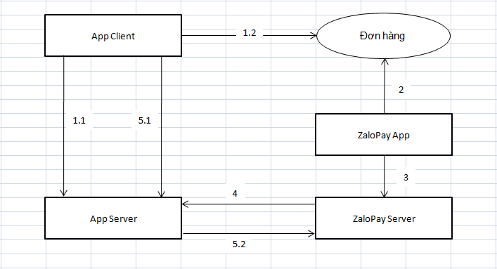

# Tổng quan

1. Khi có yêu cầu thanh toán AppClient sẽ gọi lên AppServer để tạo đơn hàng.
2. ZaloPayApp tiếp nhận thông tin đơn hàng đo AppClient tạo ra .
3. ZaloPayApp giao tiếp với ZaloPayServer để thực hiện thanh toán.
4. Khi thanh toán thành công ZaloPayServer gọi lại cho AppServer (Callback).
5. AppClient gọi AppServer để lấy thông tin trạng thái thanh toán.
